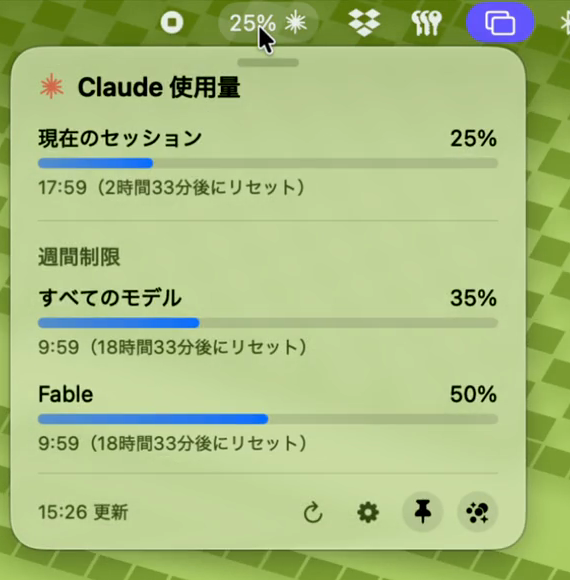

# ClaudeBar 🫧

[日本語](README.md) ｜ **English**

A native macOS menu bar app that keeps your Claude plan usage in sight.

> **Heads up:** the app's interface is currently **Japanese only** (there is no English localization yet). The numbers, gauges and percentages are language-neutral, but labels and settings are in Japanese.



The menu bar shows `42% ✳` — your current session usage plus the Claude logo. Click it to open a panel with your session and weekly limits (all models / Fable), each with the time remaining until it resets.

While Claude Code is burning tokens, the logo spins and pulses in Claude orange.


🫧 **Floating bubble mode** — a glass bubble carrying your usage drifts slowly across the screen. Switch to the three-bubble mode and session / Fable / weekly become a cluster of soap bubbles, each drifting on its own; hover to reveal every metric at once.


## Features

- **Always in the menu bar**: current session usage (the 5-hour window) with the Claude logo. Digits animate smoothly (`numericText`)
- **Panel** (click to expand, Liquid Glass)
  - Current session and weekly limits (all models / Fable) as gauges with time-to-reset
  - The Fable label is read dynamically from the API's `limits[]` (it shows "Opus" on an Opus plan)
  - Extra usage spend is shown when your account has it enabled
- **Tear-off**: drag the grip and the panel pops free with a jelly wobble (plus haptics) into a **floating panel** that no longer closes when you click elsewhere
- **Bubble mode 🫧**: a round glass bubble drifts across the whole screen, always on top, showing a usage ring
  - The trajectory is simulated a few seconds ahead and handed to `CAKeyframeAnimation`, so it stays smooth at the display's refresh rate (120 Hz on ProMotion) even when the app is busy
  - Click for a squish, **triple-click to pop 💥**, drag to move, right-click for the menu
  - Choose which metric it shows (session / weekly / Fable)
  - **Drag it onto the menu bar** and it gets sucked back in
- **It pops 💥**: when usage hits 100% in bubble mode, the bubble bursts like soap film with a pop sound, a shockwave and droplets
  - **It comes back**: once the session reset time passes, it reappears with a soft bounce (can be turned off)
- **Notifications** at 80% / 95% (can be turned off)
- **Auto-update**: Sparkle tells you when a new version ships and updates in one click (verified with an EdDSA signature; can be turned off)
- **Settings**: launch at login (SMAppService) / refresh interval (1, 2, 5 min) / notifications / bubble metric and revival / auto-update
- **Login path**: if credentials are missing or expired, the panel offers a "Log in to Claude Code" button that runs `claude /login` in Terminal

## Requirements

- macOS 14 (Sonoma) or later — Liquid Glass on macOS 26, classic frosted glass before that
- Apple Silicon (arm64)
- Claude Code signed in with a Pro / Max plan

## Install

### Homebrew (recommended)

```sh
brew install --cask sagaway3105/tap/claudebar
```

### Manual download

1. Grab `ClaudeBar-vX.X.X.zip` from [Releases](https://github.com/sagaway3105/claude-bar/releases/latest) and unzip it
2. Move `ClaudeBar.app` to **Applications** and double-click
   - Since v1.2.0 the app is **notarized by Apple** (Developer ID signed), so it opens without Gatekeeper warnings

Either way, you're done once `–% ✳` shows up in the menu bar. Updates after that arrive through the in-app updater (Sparkle).

## No extra charges

ClaudeBar **reads your existing Claude Code subscription credentials (OAuth token) read-only**. It never uses an API key (pay-per-token). Usage is fetched from the same read-only endpoint that Claude Code's own `/usage` uses, and it does not consume any tokens.

## First-time setup (how the account link works)

ClaudeBar has **no login screen of its own** — third-party apps are not allowed to offer Claude login. It piggybacks on the official Claude Code login:

1. **Install Claude Code** if you haven't: `curl -fsSL https://claude.ai/install.sh | bash`
   - If you never use the CLI (you're a Claude.ai web/app user), installing it **just once for the login** is enough. ClaudeBar reports account-wide usage from the server, including your web/app activity
   - API-key-only users are out of scope: those accounts have no 5-hour or weekly plan limits to show
2. **Launch ClaudeBar** → `–% ✳` appears. Open the panel and you'll see "credentials not found" with a **Log in to Claude Code** button
3. The button runs `claude /login` in Terminal → the **official Claude login page** opens in your browser; sign in with your Pro/Max account
4. On the next refresh (every 5 minutes by default, or ↻ in the panel) your usage appears
5. macOS may ask once for folder access — allow it (no Keychain prompt will appear)

So "whose usage am I seeing?" is simply "whichever account Claude Code is signed into on this Mac". No password ever passes through ClaudeBar.

## Build

```sh
# Produce the .app bundle (icon generation included)
./scripts/make-app.sh
open build/ClaudeBar.app

# Run while developing
swift run

# Tests
swift test
```

## How it works

| What | How |
|---|---|
| Usage % | Reads Claude Code's OAuth token through a `/usr/bin/security` subprocess (Apple-signed tools can read the item **without a dialog** thanks to its `'apple-tool:'` partition ACL), then polls `GET /api/oauth/usage` at your refresh interval (no token consumption). On failure it falls back to `cachedUsageUtilization` in `~/.claude.json` plus a `claude --safe-mode -p "/usage"` run |
| Detecting activity | Watches writes to `~/.claude/projects/**/*.jsonl` (session transcripts) with FSEvents |
| Token refresh | Never refreshes the token itself, even on the fallback path. Expired tokens are renewed by using Claude Code itself |

## Limitations

- Does not work with API billing (`ANTHROPIC_API_KEY`) alone — the endpoint is subscription-only
- `/api/oauth/usage` is a private API, so a change on Anthropic's side can break it
- The token needs the `user:profile` scope (a normal `claude /login` grants it)

## Authentication and compliance

This is an **unofficial** tool. By design:

- **No login screen of its own.** Anthropic's policy (Legal and compliance, updated 2026-02) forbids third-party apps from offering Claude.ai login or proxying requests through Free/Pro/Max credentials. ClaudeBar only reads credentials **read-only** after you sign in with Claude Code yourself
- **It never refreshes tokens.** Refresh-token rotation is left to Claude Code (avoiding both broken auth from a double refresh and the compliance risk)
- **It never calls an inference API.** Only the usage query, which consumes no tokens
- Even so, `/api/oauth/usage` is a private endpoint and Anthropic can change access to it without notice; if that happens, usage display stops working (the same position as similar OSS tools — CodexBar, Raycast extensions, and so on)
- Since v1.2.0 releases are **Developer ID signed and notarized by Apple**

## License

[MIT License](LICENSE) — Copyright (c) 2026 Atsushi Sagae
The bundled [Sparkle](https://github.com/sparkle-project/Sparkle) updater is MIT licensed as well.

"Claude" is a trademark of Anthropic PBC. This is an unofficial tool, not endorsed by, affiliated with, or supported by Anthropic.
